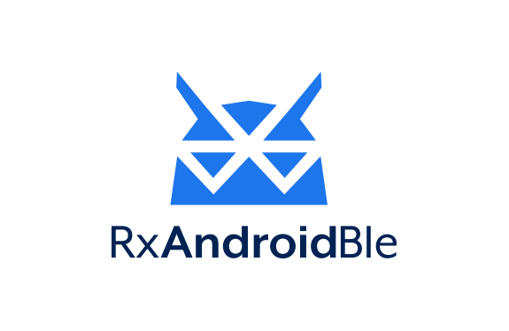

# RxAndroidBle [](https://travis-ci.org/Polidea/RxAndroidBle) [](http://search.maven.org/#search%7Cgav%7C1%7Cg%3A%22com.polidea.rxandroidble%22%20AND%20a%3A%22rxandroidble%22)
<p align="center">
  
</p>

## Introduction

RxAndroidBle is a powerful painkiller for Android's Bluetooth Low Energy headaches. It is backed by RxJava, implementing complicated APIs as handy reactive observables. The library does for you:

 * Fancy asynchronous operations support (read, write, notifications)
 * Threading management in order to meet Android contracts
 * Connection and operation error handling

For support head to [StackOverflow #rxandroidble](http://stackoverflow.com/questions/tagged/rxandroidble?sort=active)

Read the official announcement at [Polidea Blog](https://www.polidea.com/blog/RXAndroidBLE/).

## RxAndroidBLE @ Mobile Central Europe 2016
[](https://www.youtube.com/watch?v=0aKfUGCxUDM)

## Usage
### Obtaining the client
It's your job to maintain single instance of the client. You can use singleton, scoped [Dagger](http://google.github.io/dagger/) component or whatever else you want.

```java
RxBleClient rxBleClient = RxBleClient.create(context);
```

### Turning the bluetooth on / off
The library does _not_ handle managing the state of the BluetoothAdapter.
<br>Direct managing of the state is not recommended as it violates the application user's right to manage the state of their phone. See `Javadoc` of [BluetoothAdapter.enable()](https://developer.android.com/reference/android/bluetooth/BluetoothAdapter.html#enable()) method.
<br>It is the user's responsibility to inform why the application needs Bluetooth to be turned on and for ask the application's user consent.
<br>It is possible to show a native activity for turning the Bluetooth on by calling:
```java
Intent enableBtIntent = new Intent(BluetoothAdapter.ACTION_REQUEST_ENABLE);
int REQUEST_ENABLE_BT = 1;
context.startActivityForResult(enableBtIntent, REQUEST_ENABLE_BT);
```

### Device discovery
Scanning devices in the area is simple as that:

```java
Subscription scanSubscription = rxBleClient.scanBleDevices(
        new ScanSettings.Builder()
            // .setScanMode(ScanSettings.SCAN_MODE_LOW_LATENCY) // change if needed
            // .setCallbackType(ScanSettings.CALLBACK_TYPE_ALL_MATCHES) // change if needed
            .build()
        // add filters if needed
)
    .subscribe(
        scanResult -> {
            // Process scan result here.
        },
        throwable -> {
            // Handle an error here.
        }
    );

// When done, just unsubscribe.
scanSubscription.unsubscribe();
```
For devices with API <21 (before Lollipop) the scan API is emulated to get the same behaviour.

### Observing client state
On Android it is not always trivial to determine if a particular BLE operation has a potential to succeed. i.e. to scan on Android 6.0 the device needs to have a `BluetoothAdapter`, the application needs to have a granted permission to use either `ACCESS_COARSE_LOCATION` or `ACCESS_FINE_LOCATION` and `Location Services` needs to be turned on.
To be sure that the scan will work only when everything is ready you could use:

```java
Subscription flowSubscription = rxBleClient.observeStateChanges()
    .switchMap(state -> { // switchMap makes sure that if the state will change the rxBleClient.scanBleDevices() will unsubscribe and thus end the scan
        switch (state) {

            case READY:
                // everything should work
                return rxBleClient.scanBleDevices();
            case BLUETOOTH_NOT_AVAILABLE:
                // basically no functionality will work here
            case LOCATION_PERMISSION_NOT_GRANTED:
                // scanning and connecting will not work
            case BLUETOOTH_NOT_ENABLED:
                // scanning and connecting will not work
            case LOCATION_SERVICES_NOT_ENABLED:
                // scanning will not work
            default:
                return Observable.empty();
        }
    })
    .subscribe(
    	rxBleScanResult -> {
    	    // Process scan result here.
    	},
    	throwable -> {
    	    // Handle an error here.
    	}
    );
    
// When done, just unsubscribe.
flowSubscription.unsubscribe();
```

### Connection
For further BLE interactions the connection is required.

```java
String macAddress = "AA:BB:CC:DD:EE:FF";
RxBleDevice device = rxBleClient.getBleDevice(macAddress);

Subscription subscription = device.establishConnection(false) // <-- autoConnect flag
    .subscribe(
        rxBleConnection -> {
            // All GATT operations are done through the rxBleConnection.
        },
        throwable -> {
            // Handle an error here.
        }
    );

// When done... unsubscribe and forget about connection teardown :)
subscription.unsubscribe();
```

#### Auto connect
From <a href="https://developer.android.com/reference/android/bluetooth/BluetoothDevice.html#connectGatt(android.content.Context, boolean, android.bluetooth.BluetoothGattCallback)">BluetoothDevice.connectGatt() Javadoc</a>:
> autoConnect	boolean: Whether to directly connect to the remote device (false) or to automatically connect as soon as the remote device becomes available (true).

Auto connect concept may be misleading at first glance. With the autoconnect flag set to false the connection will end up with an error if a BLE device is not advertising when the `RxBleDevice#establishConnection` method is called. From platform to platform timeout after which the error is emitted differs, but in general it is rather tens of seconds than single seconds (~30 s).

Setting the auto connect flag to true allows you to wait until the BLE device becomes discoverable. The `RxBleConnection` instance won't be emitted until the connection is fully set up. From experience it also handles acquiring wake locks, so it's safe to assume that your Android device will be woken up after the connection has been established - but it is not a documented feature and may change in the future system releases.

Be careful not to overuse the autoConnect flag. On the other side it has negative impact on the connection initialization speed. Scanning window and interval is lowered as it is optimized for background use and depending on Bluetooth parameters it may (and usually do) take more time to establish the connection.

### Read / write operations
#### Read
```java
device.establishConnection(false)
    .flatMap(rxBleConnection -> rxBleConnection.readCharacteristic(characteristicUUID))
    .subscribe(
        characteristicValue -> {
            // Read characteristic value.
        },
        throwable -> {
            // Handle an error here.
        }
    );
```
#### Write
```java
device.establishConnection(false)
    .flatMap(rxBleConnection -> rxBleConnection.writeCharacteristic(characteristicUUID, bytesToWrite))
    .subscribe(
        characteristicValue -> {
            // Characteristic value confirmed.
        },
        throwable -> {
            // Handle an error here.
        }
    );
```
#### Multiple reads
```java
device.establishConnection(false)
    .flatMap(rxBleConnection -> Observable.combineLatest(
        rxBleConnection.readCharacteristic(firstUUID),
        rxBleConnection.readCharacteristic(secondUUID),
        YourModelCombiningTwoValues::new
    ))
    .subscribe(
        model -> {
            // Process your model.
        },
        throwable -> {
            // Handle an error here.
        }
    );
```
#### Long write
```java
device.establishConnection(false)
    .flatMap(rxBleConnection -> rxBleConnection.createNewLongWriteBuilder()
        .setCharacteristicUuid(uuid) // required or the .setCharacteristic()
        // .setCharacteristic() alternative if you have a specific BluetoothGattCharacteristic
        .setBytes(byteArray)
        // .setMaxBatchSize(maxBatchSize) // optional -> default 20 or current MTU
        // .setWriteOperationAckStrategy(ackStrategy) // optional to postpone writing next batch
        .build()
    )
    .subscribe(
        byteArray -> {
            // Written data.
        },
        throwable -> {
            // Handle an error here.
        }
    );
```
#### Read and write combined

```java
device.establishConnection(false)
    .flatMap(rxBleConnection -> rxBleConnection.readCharacteristic(characteristicUuid)
        .doOnNext(bytes -> {
            // Process read data.
        })
        .flatMap(bytes -> rxBleConnection.writeCharacteristic(characteristicUuid, bytesToWrite))
    )
    .subscribe(
        writeBytes -> {
            // Written data.
        },
        throwable -> {
            // Handle an error here.
        }
    );
```
### Change notifications
```java
device.establishConnection(false)
    .flatMap(rxBleConnection -> rxBleConnection.setupNotification(characteristicUuid))
    .doOnNext(notificationObservable -> {
        // Notification has been set up
    })
    .flatMap(notificationObservable -> notificationObservable) // <-- Notification has been set up, now observe value changes.
    .subscribe(
        bytes -> {
            // Given characteristic has been changes, here is the value.
        },
        throwable -> {
            // Handle an error here.
        }
    );
```
### Observing connection state
If you want to observe changes in device connection state just subscribe like below. On subscription you will receive the most current state instantly.

```java
device.observeConnectionStateChanges()
    .subscribe(
        connectionState -> {
            // Process your way.
        },
        throwable -> {
            // Handle an error here.
        }
    );
```
### Logging
For connection debugging you can use extended logging

```java
RxBleClient.setLogLevel(RxBleLog.DEBUG);
```

### Error handling
Every error you may encounter is provided via onError callback. Each public method has JavaDoc explaining possible errors.

*Important* — Prior to version `1.3.0` each failure on `BluetoothGatt` was effectively closing the connection. From `1.3.0` onwards individual errors will not close the connection if they are not directly related to it. This change does allow to retry operations (i.e. after Android will establish a device bond).

### Observable behaviour
From different interfaces, you can obtain different `Observable`s which exhibit different behaviours.
There are three types of `Observable`s that you may encounter.
1. Single value, completing — i.e. `RxBleConnection.readCharacteristic()`, `RxBleConnection.writeCharacteristic()`, etc.
2. Multiple values, not completing - i.e. `RxBleClient.scan()`, `RxBleDevice.observeConnectionStateChanges()` and `Observable` emitted by `RxBleConnection.setupNotification()` / `RxBleConnection.setupIndication()`
3. Single value, not completing — these usually are meant for auto cleanup upon unsubscribing i.e. `setupNotification()` / `setupIndication()` — when you will unsubscribe the notification / indication will be disabled 

`RxBleDevice.establishConnection()` is an `Observable` that will emit a single `RxBleConnection` but will not complete as the connection may be later a subject to an error (i.e. external disconnection). Whenever you are no longer interested in keeping the connection open you should unsubscribe from it which will cause disconnection and cleanup of resources. 

The below table contains an overview of used `Observable` patterns

| Interface | Function | Number of values | Completes |
| --- | --- | --- | --- |
| RxBleClient | scanBleDevices()* | Infinite | false |
| RxBleClient | observeStateChanges() | Infinite** | false** |
| RxBleDevice | observeConnectionStateChanges() | Infinite | false |
| RxBleDevice | establishConnection()* | Single | false |
| RxBleConnection | discoverServices() | Single | true |
| RxBleConnection | setupNotification()* | Single | false |
| RxBleConnection | setupNotification() emitted Observable | Infinite | false |
| RxBleConnection | setupIndication()* | Single | false |
| RxBleConnection | setupIndication() emitted Observable | Infinite | false |
| RxBleConnection | getCharacteristic() | Single | true |
| RxBleConnection | readCharacteristic() | Single | true |
| RxBleConnection | writeCharacteristic() | Single | true |
| RxBleConnection | readDescriptor() | Single | true |
| RxBleConnection | writeDescriptor() | Single | true |
| RxBleConnection | readRssi() | Single | true |
| RxBleConnection | requestMtu() | Single | true |
| RxBleConnection | queue() | User defined | User defined |
| LongWriteOperationBuilder | build() | Single | true |

\* this `Observable` when unsubscribed closes/cleans up internal resources (i.e. finishes scan, closes a connection, disables notifications)<br>
\** this `Observable` does emit only a single value and finishes in exactly one situation — when Bluetooth Adapter is not available on the device. There is no reason to monitor other states as the adapter does not appear during runtime.

### Helpers
We encourage you to check the package `com.polidea.rxandroidble.helpers` which contains handy reactive wrappers for some typical use-cases.

#### Value interpretation
Bluetooth Specification specifies formats in which `int`/`float`/`String` values may be stored in characteristics. `BluetoothGattCharacteristic` has functions for retrieving those (`.getIntValue()`/`.getFloatValue()`/`.getStringValue()`).
Since `RxAndroidBle` reads and notifications emit `byte[]` you may want to use `ValueIntepreter` helper to retrieve the same data easily.

#### Observing BluetoothAdapter state
If you would like to observe `BluetoothAdapter` state changes you can use `RxBleAdapterStateObservable`.

### Permissions
RxAndroidBle already provides all the necessary bluetooth permissions for you. Recently, Google has started checking these when releasing to the Play Store. If you have ACCESS_COARSE_LOCATION set manually you may run into an issue where your permission do not merge with RxAndroidBle's, resulting in a failure to upload to the Play Store This permission is only required on SDK 23+. If you need this permission on a lower version of Android use:

```xml
<uses-permission
  android:name="android.permission.ACCESS_COARSE_LOCATION"
  android:maxSdkVersion="22"/>
```
## More examples

Complete usage examples are located in `/sample` [GitHub repo](https://github.com/Polidea/RxAndroidBle/tree/master/sample/src/main/java/com/polidea/rxandroidble/sample).

## Download
### Gradle

```groovy
compile "com.polidea.rxandroidble:rxandroidble:1.3.3"
```
### Maven

```xml
<dependency>
  <groupId>com.polidea.rxandroidble</groupId>
  <artifactId>rxandroidble</artifactId>
  <version>1.3.3</version>
  <type>aar</type>
</dependency>
```

### Snapshot
If your are interested in cutting-edge build you can get a `SNAPSHOT` version of the library. 
NOTE: It is built from the top of the `master` branch and a subject to more frequent changes that may break the API and/or change behavior.

To be able to download it you need to add Sonatype Snapshot repository site to your `build.gradle` file:
```groovy
maven { url "https://oss.sonatype.org/content/repositories/snapshots" }
```

## Unit testing
Using RxAndroidBle enables you to unit test your application easily. For examples how to use mocking head to [MockRxAndroidBle](https://github.com/Polidea/RxAndroidBle/tree/master/mockrxandroidble).
## Contributing
If you would like to contribute code you can do so through GitHub by forking the repository and sending a pull request.

When submitting code, please make every effort to follow existing conventions and style in order to keep the code as readable as possible. Please also make sure your code compiles by running ```./gradlew clean checkstyle test```.

## Maintainers
* Dariusz Seweryn (dariusz.seweryn@polidea.com)
* Paweł Urban (pawel.urban@polidea.com)

## [Contributors](https://github.com/Polidea/RxAndroidBle/graphs/contributors), thank you!

## License

    Copyright 2016 Polidea Sp. z o.o

    Licensed under the Apache License, Version 2.0 (the "License");
    you may not use this file except in compliance with the License.
    You may obtain a copy of the License at

       http://www.apache.org/licenses/LICENSE-2.0

    Unless required by applicable law or agreed to in writing, software
    distributed under the License is distributed on an "AS IS" BASIS,
    WITHOUT WARRANTIES OR CONDITIONS OF ANY KIND, either express or implied.
    See the License for the specific language governing permissions and
    limitations under the License.


## Maintained by

[](http://www.polidea.com)
